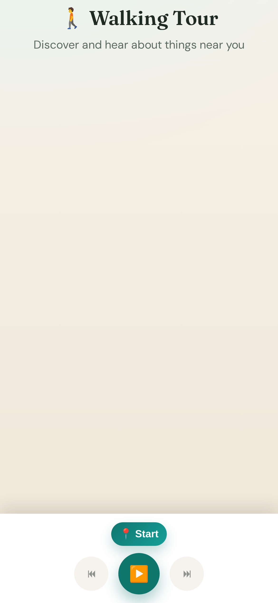

# Walking Tour 🚶

A web app that acts as your personal walking tour guide. As you walk around, it uses your location to discover nearby Wikipedia articles and reads them out loud using text-to-speech.



## Features

### 🎯 Hands-free Auto-Play Mode
- **Automatic narration**: Starts reading the nearest article immediately after finding your location
- **Sequential playback**: Automatically advances to the next nearest article when finished
- **Smart location monitoring**: Continuously checks your position every 30 seconds
- **Dynamic switching**: Switches to a significantly nearer article (>100m closer) when you move
- **Seamless experience**: Completely hands-off experience designed for walking tours

### 🎮 Manual Control Options
- **Keyboard navigation**: Use arrow keys to navigate between articles
- **Click to play**: Tap any article card to immediately start reading it
- **Stop/Resume**: Full control to pause and resume narration

### 🌍 Core Features
- 📍 **Geolocation**: Automatically detects your current location with continuous monitoring
- 🌐 **Wikipedia Integration**: Finds nearby places and landmarks within 10km using Wikipedia's geosearch API
- 🔊 **Text-to-Speech**: Reads Wikipedia article content out loud using the Web Speech API
- 📱 **Mobile-Friendly**: Responsive design that works great on phones and tablets
- 🎨 **Modern UI**: Beautiful gradient design with smooth animations

## How to Use

1. Open the app in your web browser
2. Click **"Start Tour"** and allow location access when prompted
3. The app automatically starts reading the nearest article
4. Walk around, and the app will:
   - Continue to the next nearest place after finishing each article
   - Switch to a nearer place if you move significantly closer to it
   - Update distances in real-time as you move
5. Use **arrow keys** or **click** to manually select different articles
6. Use **"Stop Reading"** to pause the narration
7. Use **"Refresh Nearby Places"** to manually update the list

## Live Demo

Visit: [https://yamatt.github.io/walking-tour/](https://yamatt.github.io/walking-tour/)

## Local Development

### Prerequisites

- Node.js 18+ and npm

### Setup

```bash
# Install dependencies
npm install

# Start development server with hot reload
npm run serve

# Build for production
npm run build

# The production files will be in the dist/ directory
```

### Project Structure

```
walking-tour/
├── src/
│   ├── app.js          # Main application logic
│   ├── styles.css      # Application styles
│   └── index.html      # HTML template
├── dist/               # Built files (generated)
├── .github/
│   ├── workflows/
│   │   └── deploy.yml  # CI/CD workflow for GitHub Pages
│   └── dependabot.yml  # Automated dependency updates
├── webpack.config.js   # Webpack configuration
└── package.json        # Project dependencies and scripts
```

## Browser Compatibility

Requires a modern browser with support for:
- Geolocation API with watchPosition
- Fetch API
- Web Speech API (for text-to-speech)
- ES6+ JavaScript features

Tested on:
- Chrome/Edge (recommended)
- Firefox
- Safari (iOS and macOS)

## Privacy

- Your location is used only to find nearby articles and is not stored or transmitted anywhere except to Wikipedia's public API
- All processing happens in your browser
- No tracking or analytics
- Location monitoring can be stopped at any time

## Technology Stack

- **Build System**: Webpack 5
- **Languages**: HTML5, CSS3, ES6+ JavaScript
- **APIs**:
  - Wikipedia geosearch and extracts API
  - Browser Geolocation API (watchPosition)
  - Web Speech API (SpeechSynthesis)
- **CI/CD**: GitHub Actions with automated deployment to GitHub Pages
- **Dependency Management**: npm with Dependabot for automated updates

## Development

The project uses modern build tools:
- **Webpack**: Module bundling with code splitting and minification
- **GitHub Actions**: Automated builds and deployments
- **Dependabot**: Automated dependency updates for npm and GitHub Actions

## License

See [LICENSE](LICENSE) file for details.
